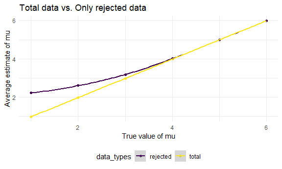

Homework 5
================
Chloe Chah

## Problem 1

### Read in the data. Describe the raw data. Create a city\_state variable.

``` r
urlfile="https://raw.githubusercontent.com/washingtonpost/data-homicides/master/homicide-data.csv"

data <- read_csv(url(urlfile))
```

    ## 
    ## -- Column specification --------------------------------------------------------
    ## cols(
    ##   uid = col_character(),
    ##   reported_date = col_double(),
    ##   victim_last = col_character(),
    ##   victim_first = col_character(),
    ##   victim_race = col_character(),
    ##   victim_age = col_character(),
    ##   victim_sex = col_character(),
    ##   city = col_character(),
    ##   state = col_character(),
    ##   lat = col_double(),
    ##   lon = col_double(),
    ##   disposition = col_character()
    ## )

``` r
homicide_df = data %>%
    mutate(
    city_state = str_c(city, state, sep = "_"),
    resolved = case_when(
    disposition == "Closed without arrest" ~ "unsolved",
    disposition == "Open/No arrest"        ~ "unsolved",
    disposition == "Closed by arrest"      ~ "solved",
    )
  ) %>% 
  select(city_state, resolved) %>% 
  filter(city_state != "Tulsa_AL")
```

The raw data is essentially showing data on homicides in 50 large U.S.
cities. The raw data contains 52178 observations. The key variables
include
uid,reported\_date,victim\_last,victim\_first,victim\_race,victim\_age,victim\_sex,city,state,latitude,longitude,disposition
(e.g. “Closed without arrest”, “Open/No arrest”, and “Closed by
arrest”).

Also as a side note, I had to download the data using the urlfile
function because I had issues downloading the csv file directly from the
link.

### Summarize within cities to obtain the total number of homicides and the number of unsolved homicides.

``` r
aggregate_df = 
  homicide_df %>% 
  group_by(city_state) %>% 
  summarize(
    hom_total = n(),
    hom_unsolved = sum(resolved == "unsolved")
  )
```

    ## `summarise()` ungrouping output (override with `.groups` argument)

``` r
aggregate_df
```

    ## # A tibble: 50 x 3
    ##    city_state     hom_total hom_unsolved
    ##    <chr>              <int>        <int>
    ##  1 Albuquerque_NM       378          146
    ##  2 Atlanta_GA           973          373
    ##  3 Baltimore_MD        2827         1825
    ##  4 Baton Rouge_LA       424          196
    ##  5 Birmingham_AL        800          347
    ##  6 Boston_MA            614          310
    ##  7 Buffalo_NY           521          319
    ##  8 Charlotte_NC         687          206
    ##  9 Chicago_IL          5535         4073
    ## 10 Cincinnati_OH        694          309
    ## # ... with 40 more rows

### For the city of Baltimore, MD, use the prop.test function to estimate the proportion of homicides that are unsolved; save the output of prop.test as an R object, apply the broom::tidy to this object and pull the estimated proportion and confidence intervals from the resulting tidy dataframe.

``` r
prop.test(
  aggregate_df %>% filter(city_state == "Baltimore_MD") %>% pull(hom_unsolved), 
  aggregate_df %>% filter(city_state == "Baltimore_MD") %>% pull(hom_total)) %>% 
  broom::tidy()
```

    ## # A tibble: 1 x 8
    ##   estimate statistic  p.value parameter conf.low conf.high method    alternative
    ##      <dbl>     <dbl>    <dbl>     <int>    <dbl>     <dbl> <chr>     <chr>      
    ## 1    0.646      239. 6.46e-54         1    0.628     0.663 1-sample~ two.sided

### Now run prop.test for each of the cities in your dataset, and extract both the proportion of unsolved homicides and the confidence interval for each. Do this within a “tidy” pipeline, making use of purrr::map, purrr::map2, list columns and unnest as necessary to create a tidy dataframe with estimated proportions and CIs for each city.

``` r
results_df = 
  aggregate_df %>% 
  mutate(
    prop_tests = map2(.x = hom_unsolved, .y = hom_total, ~prop.test(x = .x, n = .y)),
    tidy_tests = map(.x = prop_tests, ~broom::tidy(.x))
  ) %>% 
  select(-prop_tests) %>% 
  unnest(tidy_tests) %>% 
  select(city_state, estimate, conf.low, conf.high)

results_df
```

    ## # A tibble: 50 x 4
    ##    city_state     estimate conf.low conf.high
    ##    <chr>             <dbl>    <dbl>     <dbl>
    ##  1 Albuquerque_NM    0.386    0.337     0.438
    ##  2 Atlanta_GA        0.383    0.353     0.415
    ##  3 Baltimore_MD      0.646    0.628     0.663
    ##  4 Baton Rouge_LA    0.462    0.414     0.511
    ##  5 Birmingham_AL     0.434    0.399     0.469
    ##  6 Boston_MA         0.505    0.465     0.545
    ##  7 Buffalo_NY        0.612    0.569     0.654
    ##  8 Charlotte_NC      0.300    0.266     0.336
    ##  9 Chicago_IL        0.736    0.724     0.747
    ## 10 Cincinnati_OH     0.445    0.408     0.483
    ## # ... with 40 more rows

### Create a plot that shows the estimates and CIs for each city – check out geom\_errorbar for a way to add error bars based on the upper and lower limits. Organize cities according to the proportion of unsolved homicides.

``` r
results_df %>% 
  mutate(city_state = fct_reorder(city_state, estimate)) %>% 
  ggplot(aes(x = city_state, y = estimate)) +
  geom_point() + 
  geom_errorbar(aes(ymin = conf.low, ymax = conf.high)) + 
  theme(axis.text.x = element_text(angle = 90, vjust = 0.5, hjust = 1))
```


## Problem 2

### Create a tidy dataframe containing data from all participants, including the subject ID, arm, and observations over time.

``` r
path_df = tibble(
  path = list.files("problem2_data"), 
) %>%
  mutate(
    path = str_c("problem2_data/", path), 
    data = map(.x = path, ~read.csv(.x), col_type = "dddddddd"), 
  ) %>%
  separate(path, into = c("cut", "path"), sep = "/") %>%
  separate(path, into = c("arm", "subject_id"), sep = "_") %>%
  select(-cut) %>%
  unnest(data) %>%
  pivot_longer(
    week_1:week_8, 
    names_to = "week_number", 
    values_to = "value"
  ) %>%
  mutate(week_number = str_replace(week_number, "week_", "")) %>%
  mutate(subject_id = str_replace(subject_id, ".csv", "")) %>%
  mutate(arm = str_replace(arm, "con", "control")) %>%
  mutate(arm = str_replace(arm, "exp", "experimental"))

head(path_df)
```

    ## # A tibble: 6 x 4
    ##   arm     subject_id week_number value
    ##   <chr>   <chr>      <chr>       <dbl>
    ## 1 control 01         1            0.2 
    ## 2 control 01         2           -1.31
    ## 3 control 01         3            0.66
    ## 4 control 01         4            1.96
    ## 5 control 01         5            0.23
    ## 6 control 01         6            1.09

### Make a spaghetti plot showing observations on each subject over time, and comment on differences between groups.

``` r
path_df %>%
  ggplot(aes(x = week_number, y = value, group = subject_id, color = subject_id)) + 
  geom_line() + geom_point() +
  facet_grid(.~ arm) + 
  labs(title = "Observations on each subject over time", 
       x = "Week number", 
       y = "Value")
```


It appears that the average value seems to be higher in general in the
experimental group than the control group. On the other hand, the
observed values for the control group tend to be between the range of
-2.5 and 5. While there is no clear increasing or decreasing trend in
the control group and the values seem to fluctuate quite a bit over time
for both groups, the values seem to be showing a general increasing
trend over time in the experimental group compared to the control group.

## Problem 3

### Set up function

``` r
sim_ttest = function(mu) {
 
  sim_data = tibble(
    x = rnorm(n = 30, mean = mu, sd = 5),
  )
 
  sim_data %>%
    t.test(mu = 0, alternative = "two.sided", conf.level = 0.95) %>%
    broom::tidy() %>%
    select(estimate,p.value)
}

sim_ttest(0)
```

    ## # A tibble: 1 x 2
    ##   estimate p.value
    ##      <dbl>   <dbl>
    ## 1   -0.514   0.544

### Generate 5000 datasets from the model.

``` r
sim_results = 
  rerun(5000, sim_ttest(0)) %>%
  bind_rows
```

### Repeat for μ={1,2,3,4,5,6}.

``` r
sim_results = 
  tibble(mu = c(1,2,3,4,5,6)) %>% 
  mutate(
    output_lists = map(.x = mu, ~rerun(5000, sim_ttest(.x))), 
    estimate_dfs = map(output_lists, bind_rows)
  ) %>%
  select(-output_lists) %>%
  unnest(estimate_dfs)
```

### Make a plot showing the proportion of times the null was rejected (the power of the test) on the y axis and the true value of μ on the x axis. Describe the association between effect size and power.

``` r
sim_results %>%
  mutate(reject = ifelse(p.value < 0.05, 1, 0)) %>%
  group_by(mu) %>%
  summarize(prop_reject = mean(reject)) %>%
  ggplot(aes(x = mu, y = prop_reject)) +
  geom_point() + geom_smooth()+
  labs(
  title = "Proportion of times the null is rejected",
  x = "True value of Mu",
  y = "Power")
```

    ## `summarise()` ungrouping output (override with `.groups` argument)

    ## `geom_smooth()` using method = 'loess' and formula 'y ~ x'

    ## Warning in simpleLoess(y, x, w, span, degree = degree, parametric =
    ## parametric, : Chernobyl! trL>n 6
    
    ## Warning in simpleLoess(y, x, w, span, degree = degree, parametric =
    ## parametric, : Chernobyl! trL>n 6

    ## Warning in sqrt(sum.squares/one.delta): NaNs produced

    ## Warning in stats::qt(level/2 + 0.5, pred$df): NaNs produced

    ## Warning in max(ids, na.rm = TRUE): no non-missing arguments to max; returning -
    ## Inf


It appears that there is a positive correlation between effect size and
power. That is, as the effect size increases, the power also increases.
Power seems to plateau and reaches its highest point around the effect
size = 4 (given that the null hypothesis is mu = 0 and alpha = 0.05).
This result makes sense because for a given population standard
deviation, the greater the difference between the means of the null and
alternative distributions, the greater the power.

### Make a plot showing the average estimate of μ^ on the y axis and the true value of μ on the x axis. Make a second plot (or overlay on the first) the average estimate of μ^ only in samples for which the null was rejected on the y axis and the true value of μ on the x axis. Is the sample average of μ^ across tests for which the null is rejected approximately equal to the true value of μ? Why or why not?

``` r
data_total = 
  sim_results %>%
  mutate(result = case_when(
    p.value < 0.05 ~ "rejected", 
    p.value >= 0.05 ~ "fail to reject"
  )) %>% 
  group_by(mu) %>%
  summarize(
    total = mean(estimate)
  )
```

    ## `summarise()` ungrouping output (override with `.groups` argument)

``` r
only_rejected = 
  sim_results %>%
  mutate(result = case_when(
    p.value < 0.05 ~ "rejected", 
    p.value >= 0.05 ~ "fail to reject"
  )) %>% 
  filter(result == "rejected") %>%
  group_by(mu) %>%
  summarize(
    rejected = mean(estimate)
  )
```

    ## `summarise()` ungrouping output (override with `.groups` argument)

``` r
combined_graph = 
  left_join(data_total, only_rejected, by = "mu") %>%
  pivot_longer(
    total:rejected, 
    names_to = "data_types", 
    values_to = "avg_estimated_mu"
  )

combined_graph %>%
  ggplot(aes(x = mu, y = avg_estimated_mu, color = data_types)) + 
  geom_point() + 
  geom_smooth() +
  labs(title = "Total data vs. Only rejected data",
  x = "True value of mu",
  y = "Average estimate of mu")
```

    ## `geom_smooth()` using method = 'loess' and formula 'y ~ x'

    ## Warning in simpleLoess(y, x, w, span, degree = degree, parametric =
    ## parametric, : Chernobyl! trL>n 6
    
    ## Warning in simpleLoess(y, x, w, span, degree = degree, parametric =
    ## parametric, : Chernobyl! trL>n 6

    ## Warning in sqrt(sum.squares/one.delta): NaNs produced

    ## Warning in stats::qt(level/2 + 0.5, pred$df): NaNs produced

    ## Warning in simpleLoess(y, x, w, span, degree = degree, parametric =
    ## parametric, : Chernobyl! trL>n 6
    
    ## Warning in simpleLoess(y, x, w, span, degree = degree, parametric =
    ## parametric, : Chernobyl! trL>n 6

    ## Warning in sqrt(sum.squares/one.delta): NaNs produced

    ## Warning in stats::qt(level/2 + 0.5, pred$df): NaNs produced

    ## Warning in max(ids, na.rm = TRUE): no non-missing arguments to max; returning -
    ## Inf
    
    ## Warning in max(ids, na.rm = TRUE): no non-missing arguments to max; returning -
    ## Inf



The sample average of estimated μ across tests for which the null is
rejected is NOT approximately equal to the true value of mu for lower
values of true mu because there is some divergence between the two lines
at those points. However, as we approach larger true mu values, the two
lines converge, indicating that the sample average of estimated mu
across tests for which the null is rejected becomes approximately equal
to the true value of mu as the true values of mu become larger. The
convergence between the two lines seems to happen around the true mu
value of 4, which is when the power reaches its highest point of 1,
which makes sense.
